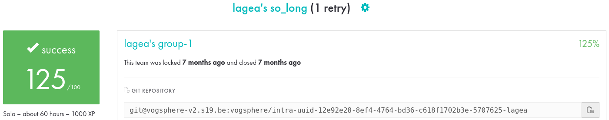
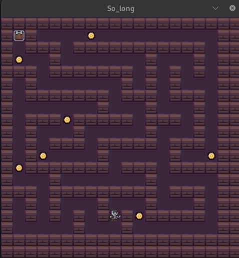

# so_long

This repository contains my implementation of the **so_long** project from [42](https://www.42.fr/). The goal of the project is to create a **2D game** using the **MinilibX** library, featuring a character that collects items on a map and eventually exits the level.



Link to the subject: [Click Here](docs/en.subject.pdf)

## Table of Contents

1. [About the Project](#about-the-project)  
2. [Project Structure](#project-structure)  
3. [Gameplay and Controls](#gameplay-and-controls)  
4. [Requirements](#requirements)  
5. [Installation and Compilation](#installation-and-compilation)  
6. [Usage](#usage)  

---

## About the Project

**so_long** is an introductory graphics programming project at 42. The idea is to parse a map (in `.ber` format) and create a window where the player can move around, pick up collectible items, and eventually reach an exit. Key points include:

- Parsing map files for walls, empty spaces, collectibles, player spawn, and exit.  
- Validating the map layout (e.g., walls around edges, valid path to exit, etc.).  
- Rendering a small 2D tile-based environment with **MinilibX**.  
- Managing basic events such as key presses and window close actions.




### Learning Objectives

- Work with the **MinilibX** library to handle window creation and events.  
- Understand basic 2D game logic and tile-based rendering.  
- Parse and validate file inputs.  
- Master pointer management and event handling in C.  

---

## Project Structure

- **inc/**: Holds the project’s headers with function prototypes and relevant data structures.  
- **src/**: Source files implementing the core functionality (map loading, event handling, etc.).  
- **assets/**: XPM images or other graphical assets used for rendering.  
- **maps/**: Example map files in the `.ber` format.  
- **Makefile**: Defines compilation targets (e.g., `all`, `clean`, `fclean`, `re`).

---

## Gameplay and Controls

1. **Objective**:  
   - Collect all items (`C`) on the map.  
   - Reach the exit (`E`) without getting blocked.  
2. **Map Layout**:  
   - `1` represents walls.  
   - `0` represents walkable floor.  
   - `C` represents collectibles.  
   - `P` represents the player start position (unique).  
   - `E` represents the exit.  
3. **Controls**:  
   - **W / A / S / D** or **↑ / ← / ↓ / →** to move.  
   - **Esc** or window close button to exit the game.  

**Exemple Map**
```bash
1111111111111
10010000P0001
111001CCCC111
10C01100E0001
1111111111111
```

---

## Requirements

- A Unix-like system (**Linux** or **macOS**).  
- The **MinilibX** library (provided by 42 or installed via the project instructions).  
- A functioning C compiler (GCC or Clang).  


---

## Installation and Compilation

1. **Clone the Repository**  
   ```bash
   git clone --recursive https://github.com/leoagea/19_so_long.git so_long
   cd so_long
   ```

2. **Compile the minilibx**
   ```bash
   cd mlx-*** //depends on your OS
   make
   cd ..
   ```

3. **Compile the project**
   ```bash
   make
   make bonus
   ```

---

## Usage

```bash
./so_long [map_file].ber
./so_long_bonus [map_file].ber
```

Now collect all the coins to finish the map.